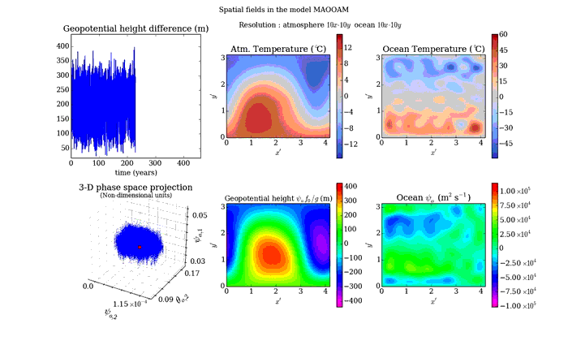

# Modular arbitrary-order ocean-atmosphere model: MAOOAM

------------------------------------------------------------------------

## About ##

(c) 2013-2016 Lesley De Cruz and Jonathan Demaeyer

See LICENSE.txt for license information.

This software is provided as supplementary material with:

* De Cruz, L., Demaeyer, J. and Vannitsem, S.: The Modular Arbitrary-Order
Ocean-Atmosphere Model: MAOOAM v1.0, Geosci. Model Dev., 9, 2793-2808,
[doi:10.5194/gmd-9-2793-2016](http://dx.doi.org/10.5194/gmd-9-2793-2016), 2016.

**Please cite this article if you use (a part of) this software for a
publication.**

The authors would appreciate it if you could also send a reprint of
your paper to <lesley.decruz@meteo.be>, <jonathan.demaeyer@meteo.be> and
<svn@meteo.be>. 

Consult the MAOOAM [code repository](http://www.github.com/Climdyn/MAOOAM)
for updates, and [our website](http://climdyn.meteo.be) for additional
resources.

------------------------------------------------------------------------

## Model description ##
## High resolution enabled version

The atmospheric component of the model is based on the papers of Charney and
Straus (1980), Reinhold and Pierrehumbert (1982) and  Cehelsky and Tung (1987),
all published in the Journal of Atmospheric Sciences. The ocean component is
based on the papers of Pierini (2012), Barsugli and Battisti (1998). The
coupling between the two components includes wind forcings, radiative and heat
exchanges.

------------------------------------------------------------------------

## Implementation notes ##

As the system of differential equations is at most bilinear in y[j] (j=1..n), y
being the array of variables, it can be expressed as a tensor contraction
(written using Einstein convention, i.e. indices that occur twice on one side
of an equation are summed over):

    dy  / dt =  T        y   y      (y  == 1)
      i          i,j,k    j   k       0

The tensor T that encodes the differential equations is composed so that:

* T[i][j][k] contains the contribution of dy[i]/dt proportional to y[j]*y[k].
* Furthermore, y[0] is always equal to 1, so that T[i][0][0] is the constant
  contribution to var dy[i]/dt.
* T[i][j][0] + T[i][0][j] is the contribution to  dy[i]/dt which is linear in
  y[j].

Ideally, the tensor is composed as an upper triangular matrix (in the last two
coordinates).

------------------------------------------------------------------------

## References ##

* Charney, J. G. and Straus, D. M.: Form-drag instability, multiple equilibria
and propagating planetary waves in baroclinic, orographically forced, planetary
wave systems, J. Atmos. Sci., 37, 1157-1176, 1980.

* Reinhold, B. B. and Pierrehumbert, R. T.: Dynamics of weather regimes:
quasi-stationary waves and blocking, Mon. Weather Rev., 110, 1105-1145, 1982.

* Reinhold, B. B. and Pierrehumbert, R. T.: Corrections to "Dynamics of
weather regimes: quasi-stationary waves and blocking", Mon. Weather Rev., 113,
2055-2056, 1985.

* Barsugli, J. J. and Battisti, D. S.: The basic effects of atmosphere–ocean
 thermal coupling on midlatitude variability, J. Atmos. Sci., 55, 477-493, 1998.

* Pierini, S.: Low-frequency variability, coherence resonance, and phase
selection in a low-order model of the wind-driven ocean circulation, J.  Phys.
Oceanogr., 41, 1585-1604, 2011.

* Cehelsky, P. and Tung, K. K.: Theories of multiple equilibria and weather
regimes - A critical reexamination.  Part II: Baroclinic two-layer models,
Journal of the atmospheric sciences, 44, 3282-3303, 1987.

* Vannitsem, S. and De Cruz, L.: A 24-variable low-order coupled
ocean-atmosphere model: OA-QG-WS v2, Geoscientific Model Development, 7,
649-662, 2014.

* Vannitsem, S., Demaeyer, J., De Cruz, L., and Ghil, M.: Low-frequency
variability and heat transport in a loworder nonlinear coupled ocean-atmosphere
model, Physica D: Nonlinear Phenomena, 309, 71-85, 2015. 

Please see the main article for the full list of references.

------------------------------------------------------------------------

## Related projects ##

* [DAPPER](https://github.com/nansencenter/DAPPER) - Data Assimilation Package in Python for Experimental Research.
The MAOOAM python implementation is available within the package.

